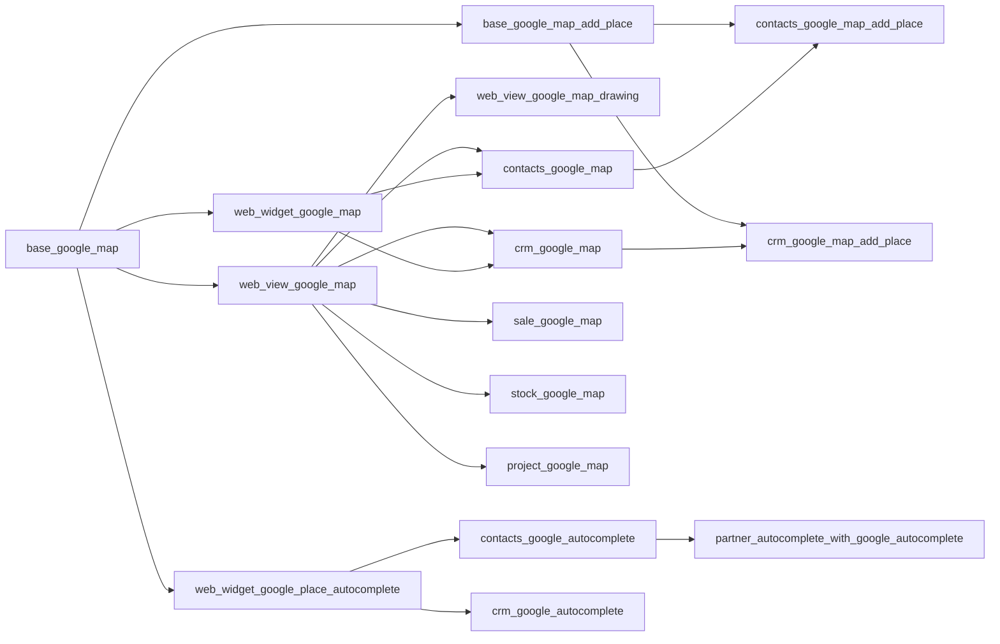

# Odoo Google Maps Integration

A suite of Odoo 19.0 addons that bring interactive Google Maps to Odoo — covering map views with marker clustering and drawing tools, address autocomplete via Google Places API (New), click-to-create workflows, an embedded map form widget, and application-specific integrations for Contacts, CRM, Sales, Inventory, and Projects.

Most of the implementation follows samples and guidance from the [Google Maps JavaScript Guide](https://developers.google.com/maps/documentation/javascript).

---

## What's Included

| Capability | Modules |
| --- | --- |
| Configuration & shared API loader | `base_google_map` |
| Map view infrastructure | `web_view_google_map` |
| Geographic drawing & GeoJSON map view | `web_view_google_map_drawing` |
| Embedded map form widget | `web_widget_google_map` |
| Place autocomplete widget & mapping system | `web_widget_google_place_autocomplete` |
| Click-to-create base | `base_google_map_add_place` |
| Contacts map & autocomplete | `contacts_google_map`, `contacts_google_map_add_place`, `contacts_google_autocomplete`, `partner_autocomplete_with_google_autocomplete` |
| CRM map & autocomplete | `crm_google_map`, `crm_google_map_add_place`, `crm_google_autocomplete` |
| Sales map | `sale_google_map` |
| Inventory map | `stock_google_map` |
| Project map | `project_google_map` |

---

## Architecture

The suite is organized into three layers. Each layer builds on the one below — you install only what you need.

### Layer 1 — Foundation

**`base_google_map`** is the single dependency of every other module. It stores the API Key, Map ID, language, region, color scheme, and nearby search radius in General Settings, and provides the shared `useGoogleMapsAPILoader` JavaScript service that handles async script loading for all other modules.

### Layer 2 — View Framework, Widgets & Click-to-Create

**`web_view_google_map`** provides the full MVC stack for map views: controller, model, renderer, and sidebar. It handles record-map synchronization, marker clustering, overlap handling, multi-selection (box select), nearby records search, in-map place search, geolocation button, grouped markers, dark mode, and action menus. All application map view modules extend this base.

**`web_view_google_map_drawing`** extends the map view with geographic shape drawing using [Terra Draw](https://terradraw.io/) and GPU-accelerated rendering via [Deck.gl](https://deck.gl/). Provides a `google.drawing.shape` mixin and a GeoJSON field type with server-side filtering. All libraries are bundled locally.

**`web_widget_google_map`** provides a standalone form field widget (`google_map`) — an embedded Google Maps iframe showing a record's coordinates, with an edit dialog containing a draggable marker and place search.

**`web_widget_google_place_autocomplete`** provides the `gplace_autocomplete_el` widget and a `google.places.mapping` configuration system. Connects the Google Places API (New) to any Odoo Char field; which fields are populated on selection is fully controlled by mapping records.

**`base_google_map_add_place`** provides the abstract Python mixin and `InMapClickAddPlace` OWL component for click-to-create workflows. Application modules extend this instead of re-implementing the pattern.

### Layer 3 — Applications

Application modules consume the framework to deliver specific functionality. They never re-implement map rendering or library loading.

---

## Modules

### Infrastructure

**[base_google_map](base_google_map/README.md)** `19.0.1.0.11`

Root configuration module. Adds a Google Maps section to General Settings for API Key, Map ID, language, region, color scheme, and nearby search radius. Provides the shared `useGoogleMapsAPILoader` JavaScript API loader used by every other module in this suite.

**[web_view_google_map](web_view_google_map/README.md)** `19.0.1.0.24`

Registers `google_map` as a valid Odoo view type. Provides the full map view stack — controller, model, renderer, sidebar, and search bar — with marker clustering, overlap handling, multi-selection box select, nearby records search, in-map place search, geolocation button, grouped markers, and dark mode support.

**[web_view_google_map_drawing](web_view_google_map_drawing/README.md)** `19.0.1.0.20`

Extends the map view with geographic shape drawing using [Terra Draw](https://terradraw.io/) (Google's recommended replacement for the deprecated Maps Drawing Library) for editing and [Deck.gl](https://deck.gl/) for GPU-accelerated rendering of large datasets. Includes a `google.drawing.shape` mixin and GeoJSON field type with server-side filtering. All libraries bundled locally.

**[web_widget_google_map](web_widget_google_map/README.md)** `19.0.1.0.4`

Provides the `google_map` form widget — an embedded Google Maps iframe showing a record's coordinates, with an edit dialog containing a draggable marker and place search for visually updating the location without leaving the form.

**[web_widget_google_place_autocomplete](web_widget_google_place_autocomplete/README.md)** `19.0.1.0.7`

Provides the `gplace_autocomplete_el` widget and the `google.places.mapping` configuration system. Connects Google Places API (New) to any Odoo Char field. Which fields are populated on selection is fully controlled by mapping records — supporting two autocomplete modes, three component handling modes, configurable separators, relational field auto-resolution, and a live built-in test tool.

**[base_google_map_add_place](base_google_map_add_place/README.md)** `19.0.1.0.3`

Abstract base for the click-to-create workflow. Provides the `google_map.add_place.mixin` Python mixin and the `InMapClickAddPlace` OWL component with zoom threshold logic and smart zoom shortcut. Application modules extend this instead of re-implementing the pattern.

---

### Contacts

**[contacts_google_map](contacts_google_map/README.md)** `19.0.1.0.10`

Adds a Google Map view to the Contacts application with color-coded partner markers. Adds a Geolocation tab to the partner form with an embedded map, geocode button, marker color picker, nearby search, and an optional background geocoding cron job.

**[contacts_google_map_add_place](contacts_google_map_add_place/README.md)** `19.0.1.0.2`

Activates click-to-create on the Contacts map view. Clicking a named Google Place or empty map location opens a pre-populated partner creation form. Duplicate detection prevents creating a second record for the same Google Place ID.

**[contacts_google_autocomplete](contacts_google_autocomplete/README.md)** `19.0.1.0.2`

Applies `gplace_autocomplete_el` to the Contact form's name field (`places` mode) and street field (`address` mode). Populates address fields and coordinates on selection. Mapping configurations for `res.partner` are created automatically on installation.

**[partner_autocomplete_with_google_autocomplete](partner_autocomplete_with_google_autocomplete/README.md)** `19.0.1.0.5`

Combines Odoo's built-in partner autocomplete with a Google Places toggle panel on the Contact name field, applied to all `res.partner` form views automatically via `_get_view()` — no XML changes required. The Odoo partner autocomplete remains available on the same input.

---

### CRM

**[crm_google_map](crm_google_map/README.md)** `19.0.1.0.10`

Adds a Google Map view across five CRM menus (All Leads, My Activities, Opportunities, Pipeline, Forecast). Each lead appears as a color-coded marker card with stage, contact, salesperson, revenue, probability, and closing date. The lead form gains a Geolocation tab, geocode button, color picker, and an embedded map preview.

**[crm_google_map_add_place](crm_google_map_add_place/README.md)** `19.0.1.0.1`

Activates click-to-create on the CRM map view. Named place clicks create a pre-filled lead with address, phone, website, coordinates, and an auto-generated opportunity name. Empty map clicks reverse-geocode the coordinate. Duplicate detection uses the Google Place ID.

**[crm_google_autocomplete](crm_google_autocomplete/README.md)** `19.0.1.0.3`

Applies `gplace_autocomplete_el` to the Lead/Opportunity form's company name field (`places` mode) and street field (`address` mode), in both the quick-entry group and the detailed lead tab. Auto-fills address fields and CRM geolocation fields on selection.

---

### Sales

**[sale_google_map](sale_google_map/README.md)** `19.0.1.0.13`

Adds a Google Map view to Quotations, Orders, Orders to Invoice, Orders to Upsell, and Customers in Sales. Groups records by customer — one marker per customer — showing avatar, name, order count, and aggregated order total. Enforces grouping and auto-loads all groups on open.

---

### Inventory

**[stock_google_map](stock_google_map/README.md)** `19.0.1.0.0`

Adds a Google Map view across Deliveries, Ready to Transfer, Waiting Transfer, Late Transfers, Backorders, and All Operations in Inventory. Each picking appears as a teal marker at the delivery partner's address, with coordinates sourced automatically from the linked partner.

---

### Project

**[project_google_map](project_google_map/README.md)** `19.0.1.0.4`

Adds a Google Map view for Projects and Tasks. Project markers show task counts and completion statistics; a satellite site map is embedded on the project form. Task maps are scoped per project. Status color-coding (on track, at risk, off track, on hold, done) is configurable per project.

---

## Getting Started

### 1. Get a Google API Key

Sign up at [Google Cloud Console](https://console.cloud.google.com/) and create an API key. Enable the following APIs in your project:

| API | Purpose |
| --- | --- |
| Maps JavaScript API | Map rendering |
| Places API (New) | Address autocomplete and place search |
| Geocoding API | Coordinate-to-address and address-to-coordinate lookup |
| Maps Embed API | Embedded map widget on forms |

→ [Get a Google Maps API Key](https://developers.google.com/maps/documentation/javascript/get-api-key)

### 2. Get a Map ID

A Map ID is required for `AdvancedMarkerElement` and cloud-based map styling.

→ [Get a Map ID](https://developers.google.com/maps/documentation/javascript/map-ids/get-map-id)

### 3. Configure Odoo

Install `base_google_map`, then go to **Settings → General Settings → Google Maps** and enter your API Key and Map ID.

### 4. Install the modules you need

| Goal | Install |
| --- | --- |
| Display records on an interactive map view | `web_view_google_map` |
| Draw and query geographic shapes on a map | `web_view_google_map_drawing` |
| Show a location map inside a form | `web_widget_google_map` |
| Autocomplete addresses and places in forms | `web_widget_google_place_autocomplete` |
| Show contacts on a map | `contacts_google_map` |
| Create contacts by clicking on the map | `contacts_google_map_add_place` |
| Autocomplete addresses on the Contact form | `contacts_google_autocomplete` |
| Show CRM leads on a map | `crm_google_map` |
| Create leads by clicking on the map | `crm_google_map_add_place` |
| Show sales orders on a map | `sale_google_map` |
| Show inventory transfers on a map | `stock_google_map` |
| Show projects and tasks on a map | `project_google_map` |

Dependencies are resolved automatically — installing any module will install its prerequisites.

---

## Requirements

- **Odoo** 19.0
- **Browser** — any modern browser
- **Google API Key** — from [Google Cloud Console](https://console.cloud.google.com/)
- **Map ID** — required for `AdvancedMarkerElement` and cloud-based styling

All Terra Draw, Deck.gl and Turf.js libraries used by `web_view_google_map_drawing` are bundled locally — no CDN requests are made to load them.

| Library | Purpose |
| --- | --- |
| Terra Draw | Geographic shape drawing (polygon, rectangle, freehand) |
| Deck.gl | GPU-accelerated rendering for large GeoJSON datasets |
| Turf.js | Geospatial analysis and geometry operations (point-in-polygon, distance) |

An internet connection is required at runtime. Map tiles, geocoding, and places data are served by Google services and require a valid API key on every request.

---

## Security

- Restrict your API key to specific HTTP referrers in Google Cloud Console for production deployments
- The API key is stored in `ir.config_parameter` and is only delivered to authenticated Odoo users
- Map tiles and geocoding requests are made client-side; only coordinates and search queries are sent to Google servers

---

## Notes

These modules are not perfect — if you encounter any bugs or unexpected behavior, please open an issue.

If you would like to integrate Google Maps with another Odoo module or your own custom module, feel free to start a discussion or reach out by email.
