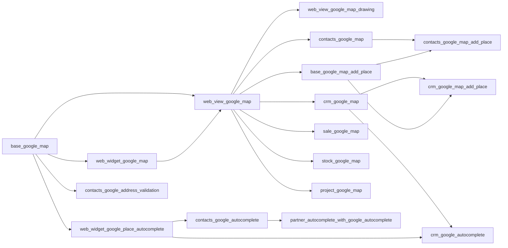

# Odoo Google Maps Integration

A suite of Odoo 19.0 addons that bring interactive Google Maps into your Odoo workflow. Visualize records on live maps, search and autocomplete addresses with Google Places, draw geographic areas, and create records directly from the map — all without leaving Odoo.

---

## What's Included

| Capability | Modules |
| --- | --- |
| API configuration & shared loader | `base_google_map` |
| Interactive map view | `web_view_google_map` |
| Geographic drawing tools | `web_view_google_map_drawing` |
| Embedded map on forms | `web_widget_google_map` |
| Address & place autocomplete | `web_widget_google_place_autocomplete` |
| Click-to-create foundation | `base_google_map_add_place` |
| Contacts map & autocomplete | `contacts_google_map`, `contacts_google_map_add_place`, `contacts_google_autocomplete`, `partner_autocomplete_with_google_autocomplete` |
| Address validation | `contacts_google_address_validation` |
| CRM map & autocomplete | `crm_google_map`, `crm_google_map_add_place`, `crm_google_autocomplete` |
| Sales map | `sale_google_map` |
| Inventory map | `stock_google_map` |
| Project map | `project_google_map` |

---

## Architecture

The suite is organized into three layers. Each layer builds on the one below — you install only what you need.

### Layer 1 — Foundation

`base_google_map` is required by every other module. It holds your Google Maps configuration — API Key, Map ID, language, region, color scheme, and nearby search radius — in General Settings, and manages the shared Google Maps script loader used by the rest of the suite.

### Layer 2 — View Framework, Widgets & Click-to-Create

`web_widget_google_map` adds an interactive map to any Odoo form. It shows the record's location and lets users update it by dragging a marker or searching for a place — without navigating away from the form.

`web_view_google_map` is the map view engine. It handles record display on the map, marker clustering, box selection, nearby search, place search, geolocation, grouped markers, and dark mode. All application map modules build on this.

`web_view_google_map_drawing` extends the map view with tools to draw and edit geographic shapes — polygons, rectangles, and freehand areas. Shapes are stored as GeoJSON and support server-side spatial filtering. All rendering libraries are bundled locally; no CDN needed.

`web_widget_google_place_autocomplete` adds a configurable Google Places autocomplete widget to any Odoo text field. When a user picks a suggestion, it automatically fills whichever Odoo fields are configured in the mapping — name, address, city, country, phone, website, coordinates, and more.

`base_google_map_add_place` is the shared foundation for click-to-create on map views. It provides the server-side logic and the map overlay that lets users click any location to open a pre-filled record creation form. Application modules build on this; you don't need to install it directly.

### Layer 3 — Applications

Application modules consume the framework to deliver specific functionality. They never re-implement map rendering or library loading.

---

## Modules

### Infrastructure

**[base_google_map](base_google_map/README.md)** [`19.0.1.0.12`](base_google_map/CHANGELOG.md)

The required foundation for every other module in this suite. Adds a Google Maps section to General Settings where you enter your API Key, Map ID, and preferences for language, region, color scheme, and nearby search radius. All other modules load the Google Maps script through this one.

**[web_view_google_map](web_view_google_map/README.md)** [`19.0.1.0.26`](web_view_google_map/CHANGELOG.md)

The core map view module. Adds a `google_map` view type alongside list, kanban, and form. Features a record sidebar, marker clustering for dense data, box selection to pick multiple records at once, nearby search, in-map place search, a geolocation button to center the map on your location, grouped markers, dark mode, and a Street View side-by-side button in every marker info window.

**[web_view_google_map_drawing](web_view_google_map_drawing/README.md)** [`19.0.1.0.22`](web_view_google_map_drawing/CHANGELOG.md)

Extends the map view with geographic drawing tools. Users can draw polygons, rectangles, and freehand shapes directly on the map. Shapes are stored as GeoJSON on the record and support server-side filtering so you can query which records fall inside a drawn area. Built on [Terra Draw](https://terradraw.io/) and [Deck.gl](https://deck.gl/); all libraries are bundled locally.

**[web_widget_google_map](web_widget_google_map/README.md)** [`19.0.1.0.10`](web_widget_google_map/CHANGELOG.md)

Adds an embedded Google Map to any Odoo form. Shows the record's saved location and lets users update it visually — by dragging a marker or typing a place name — without leaving the form. A Street View side-by-side dialog lets users verify the exact location with street-level imagery alongside the standard map; it falls back gracefully when no Street View coverage is available.

**[web_widget_google_place_autocomplete](web_widget_google_place_autocomplete/README.md)** [`19.0.1.0.9`](web_widget_google_place_autocomplete/CHANGELOG.md)

A configurable Google Places autocomplete widget for any Odoo text field. When a user picks a suggestion from the dropdown, it fills whichever Odoo fields are configured in the mapping — name, street, city, zip, country, phone, website, coordinates, and more. Includes a built-in test tool to verify mappings without leaving the settings screen.

**[base_google_map_add_place](base_google_map_add_place/README.md)** [`19.0.1.0.5`](base_google_map_add_place/CHANGELOG.md)

Shared foundation for click-to-create workflows on map views. Provides the server-side logic and map overlay that lets users click any location on the map to open a pre-filled record creation form. Application modules build on this; you don't need to install it directly.

---

### Contacts

**[contacts_google_map](contacts_google_map/README.md)** [`19.0.1.0.13`](contacts_google_map/CHANGELOG.md)

Adds a Google Map view to the Contacts application. Partners appear as color-coded markers; clicking one opens the contact card. Each contact form gains a Geolocation tab with an embedded map, a one-click geocode button, a marker color picker, and a nearby partners search. An optional background cron job can geocode all contacts automatically.

**[contacts_google_map_add_place](contacts_google_map_add_place/README.md)** [`19.0.1.0.3`](contacts_google_map_add_place/CHANGELOG.md)

Enables click-to-create on the Contacts map. Clicking a named Google Place opens a partner creation form pre-filled with name, address, phone, and website from Google's data. Clicking an empty spot reverse-geocodes the coordinate and pre-fills the address. If a contact with the same Google Place already exists, that record opens instead of creating a duplicate.

**[contacts_google_autocomplete](contacts_google_autocomplete/README.md)** [`19.0.1.0.3`](contacts_google_autocomplete/CHANGELOG.md)

Adds Google Places autocomplete to the Contact form. Typing in the partner name field suggests matching businesses and places from Google; typing in the street field suggests addresses. Selecting a suggestion fills in the address, country, phone, website, and map coordinates automatically. The required field mappings are created on installation — no manual setup needed.

**[partner_autocomplete_with_google_autocomplete](partner_autocomplete_with_google_autocomplete/README.md)** [`19.0.1.0.6`](partner_autocomplete_with_google_autocomplete/CHANGELOG.md)

Enhances the Contact name field with a Google Places panel alongside Odoo's built-in partner autocomplete. A toggle lets the user switch between Odoo's database suggestions and Google Places results on the same input. Applied automatically to all contact forms — no view customization required.

**[contacts_google_address_validation](contacts_google_address_validation/README.md)** [`19.0.2.0.0`](contacts_google_address_validation/CHANGELOG.md)

Adds a **Validate Address** button to the Contact form that checks the stored address against the Google Address Validation API. A dialog shows the validation verdict, a side-by-side comparison of the current and Google's standardized address, and a component-level breakdown with confirmation levels. Users can apply Google's standardized address and geocoordinates in one click or keep the existing address. Validation status (Validated / Needs Review / Invalid), granularity, date, and API response ID are stored on the partner and available in list views, filters, and automations. Editing any address field automatically resets the status to Not Validated.

---

### CRM

**[crm_google_map](crm_google_map/README.md)** [`19.0.1.0.12`](crm_google_map/CHANGELOG.md)

Adds a Google Map view to the CRM application, available in All Leads, My Activities, Opportunities, Pipeline, and Forecast. Each lead appears as a color-coded marker showing stage, address, company, contact, phone, salesperson, expected revenue, win probability, and closing date. Activity scheduling is available directly from each marker's info window. The lead form gains a Geolocation tab with an embedded map preview, a geocode button, and a marker color picker.

**[crm_google_map_add_place](crm_google_map_add_place/README.md)** [`19.0.1.0.2`](crm_google_map_add_place/CHANGELOG.md)

Enables click-to-create on the CRM map. Clicking a named Google Place opens a new lead form pre-filled with the business name, address, phone, website, and an auto-generated opportunity name. Clicking an empty location reverse-geocodes the coordinate and fills in the address. Duplicate detection prevents creating two leads for the same Google Place.

**[crm_google_autocomplete](crm_google_autocomplete/README.md)** [`19.0.1.0.4`](crm_google_autocomplete/CHANGELOG.md)

Adds Google Places autocomplete to the Lead and Opportunity form. Typing in the company name suggests matching businesses from Google; typing in the street suggests addresses. Works in both the quick-entry dialog and the full lead form. Selecting a suggestion fills in the address and geolocation coordinates automatically.

---

### Sales

**[sale_google_map](sale_google_map/README.md)** [`19.0.1.0.14`](sale_google_map/CHANGELOG.md)

Adds a Google Map view to the Sales application, available for Quotations, Orders, Orders to Invoice, Orders to Upsell, and Customers. Records are grouped by customer, with one marker per customer showing their avatar, name, total number of orders, and combined order value.

---

### Inventory

**[stock_google_map](stock_google_map/README.md)** [`19.0.1.0.2`](stock_google_map/CHANGELOG.md)

Adds a Google Map view to the Inventory application, covering Deliveries, Ready to Transfer, Waiting Transfer, Late Transfers, Backorders, and All Operations. Each transfer appears as a marker at the delivery address, with coordinates pulled automatically from the linked partner.

---

### Project

**[project_google_map](project_google_map/README.md)** [`19.0.1.0.7`](project_google_map/CHANGELOG.md)

Adds Google Map views for Projects and Tasks. Project markers are automatically color-coded by health status — on track, at risk, off track, on hold, and done — and include a "View Tasks" shortcut to jump directly to that project's tasks. The project form gains an embedded satellite map. Task markers can be individually color-coded using a color picker.

---

## Getting Started

### 1. Get a Google API Key

Sign up at [Google Cloud Console](https://console.cloud.google.com/) and create an API key. Enable the following APIs in your project:

| API | Purpose |
| --- | --- |
| Maps JavaScript API | Map rendering |
| Places API (New) | Address autocomplete and place search |
| Geocoding API | Coordinate-to-address and address-to-coordinate lookup |
| Address Validation API | Verify and standardize addresses |

→ [Get a Google Maps API Key](https://developers.google.com/maps/documentation/javascript/get-api-key)

### 2. Get a Map ID

A Map ID is required for advanced markers and cloud-based map styling.

→ [Get a Map ID](https://developers.google.com/maps/documentation/javascript/map-ids/get-map-id)

### 3. Configure Odoo

Install `base_google_map`, then go to **Settings → General Settings → Google Maps** and enter your API Key and Map ID.

### 4. Install the modules you need

| Goal | Install |
| --- | --- |
| Display records on an interactive map view | `web_view_google_map` |
| Draw and query geographic shapes on a map | `web_view_google_map_drawing` |
| Show a location map inside a form | `web_widget_google_map` |
| Autocomplete addresses and places in forms | `web_widget_google_place_autocomplete` |
| Show contacts on a map | `contacts_google_map` |
| Create contacts by clicking on the map | `contacts_google_map_add_place` |
| Autocomplete addresses on the Contact form | `contacts_google_autocomplete` |
| Validate and standardize Contact addresses | `contacts_google_address_validation` |
| Show CRM leads on a map | `crm_google_map` |
| Create leads by clicking on the map | `crm_google_map_add_place` |
| Show sales orders on a map | `sale_google_map` |
| Show inventory transfers on a map | `stock_google_map` |
| Show projects and tasks on a map | `project_google_map` |

Dependencies are resolved automatically — installing any module will install its prerequisites.

---

## Requirements

- **Odoo** 19.0
- **Browser** — any modern browser
- **Google API Key** — from [Google Cloud Console](https://console.cloud.google.com/)
- **Map ID** — required for advanced markers and cloud-based styling

All Terra Draw, Deck.gl and Turf.js libraries used by `web_view_google_map_drawing` are bundled locally — no CDN requests are made to load them.

| Library | Purpose |
| --- | --- |
| Terra Draw | Geographic shape drawing (polygon, rectangle, freehand) |
| Deck.gl | GPU-accelerated rendering for large GeoJSON datasets |
| Turf.js | Geospatial analysis and geometry operations (point-in-polygon, distance) |

An internet connection is required at runtime. Map tiles, geocoding, and places data are served by Google services and require a valid API key on every request.

---

## Security

- Restrict your API key to specific HTTP referrers in Google Cloud Console for production deployments
- The API key is stored in Odoo's system parameters and is only delivered to authenticated users
- Map tiles and geocoding requests are made client-side; only coordinates and search queries are sent to Google servers

---

## License

This project is licensed under the [GNU Lesser General Public License v3.0 (LGPL-3)](https://www.gnu.org/licenses/lgpl-3.0.html).

LGPL-3 permits use in commercial Odoo deployments. You can install and use these modules in a proprietary Odoo instance without it affecting the license of your own code. If you modify or distribute the modules themselves, those changes must be made available under LGPL-3.

---

## Notes

Bug reports and feature requests are welcome.

→ [Report a bug or request a feature](https://github.com/mithnusa/odoo-google-maps/issues)
→ [Start a discussion](https://github.com/mithnusa/odoo-google-maps/discussions)

If you need to integrate Google Maps into your own Odoo module, feel free to reach out by [email](mailto:yopiangi@gmail.com).
