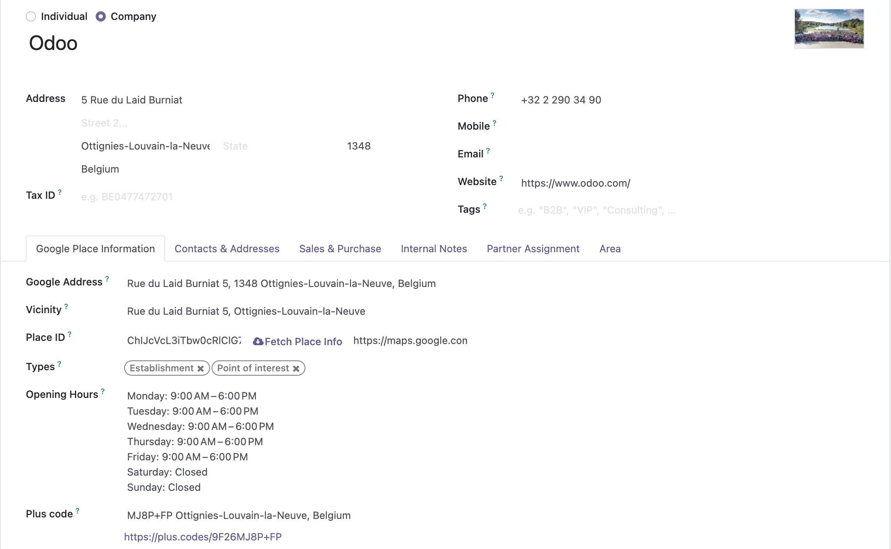

# Contacts Google Autocomplete Address Form Extended
### An extended feature of the `gplaces_address_autocomplete` widget defined on the module Contacts Google Autocomplete Address Form (contacts_gautocomplete_address_form)    

Automatically fulfill Google Places Information any time you select a place for the widget Google Places Address Form autocomplete (`gplaces_address_autocomplete`)
