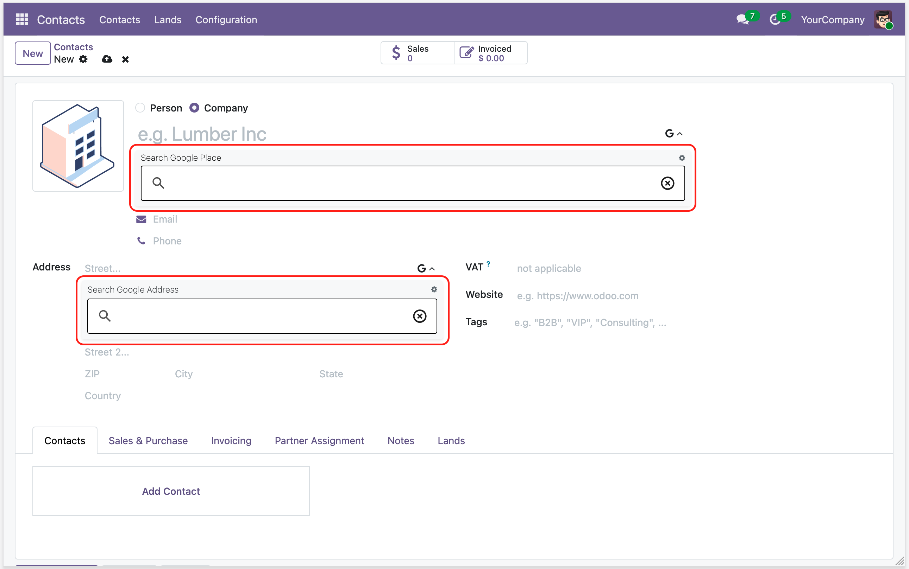
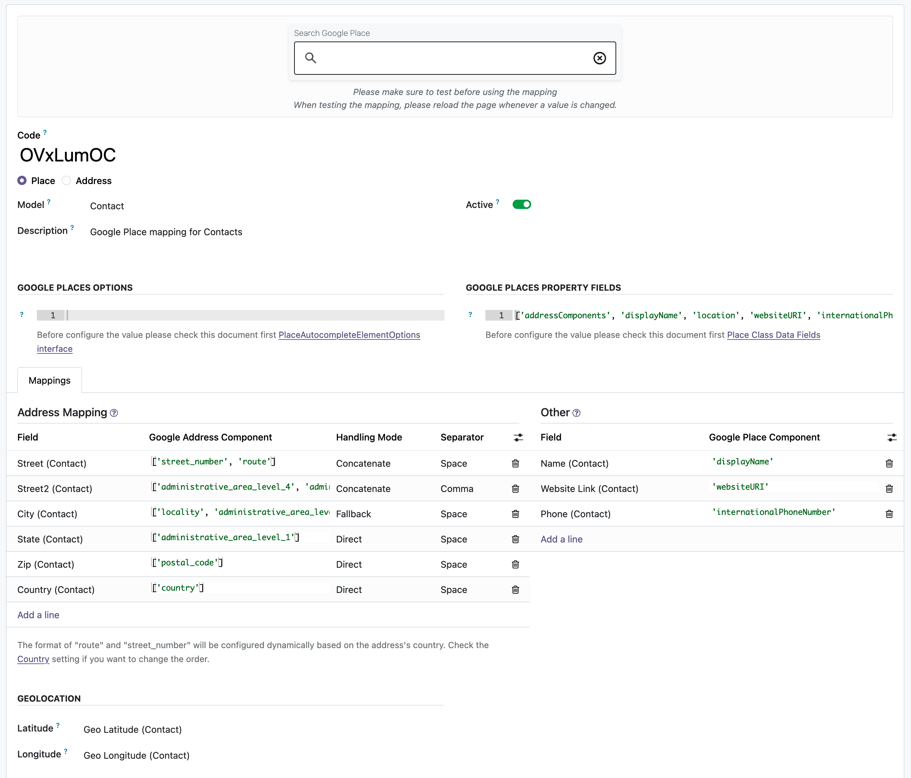

# Contacts Google Autocomplete

The `contacts_google_autocomplete` module adds [Google Places Autocomplete Element](https://developers.google.com/maps/documentation/javascript/place-autocomplete-new) functionality to the Contact form. It enhances the name and street fields with Google Places autocomplete, allowing users to quickly fill in contact information by selecting from Google Places suggestions.

## Features
- Autocomplete for Contact name and street fields using Google Places API
- Automatic population of address fields (street, city, state, zip, country) based on selected place
- Configurable field mappings between Google Places data and Odoo Contact fields

  

  

## Installation & Configuration
1. Configure your Google Maps API key in `Settings > General Settings > Google Maps`
2. The module automatically configures Google Place mapping for contacts during installation
3. Open a Contact form, a collapsible button added next to the name and street fields. Clicking it will open the Google Places autocomplete input.
4. Places API (New) must be enabled in your Google Cloud Console.

### Notes
This module replaces the following modules from previous versions:
- contacts_gautocomplete_address_form
- contacts_gautocomplete_address_form_extended
- contacts_gautocomplete_places
- contacts_gautocomplete_places_extended

## Authors
- [Yopi Angi](https://www.github.com/gityopie)
