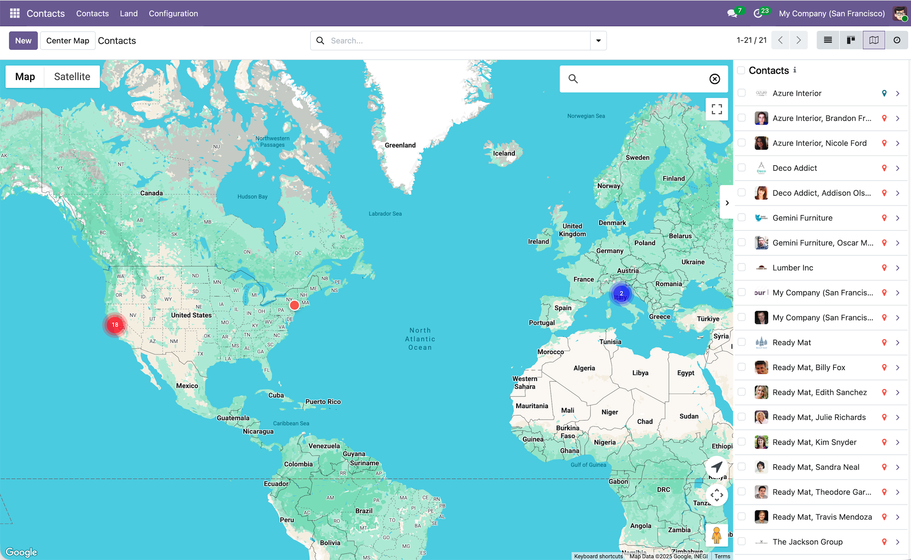

# Contacts Google Maps

The `contacts_google_map` module adds Google Maps view to the Contacts application. It allows you to visualize your contacts locations on an interactive Google Maps, making it easy to see geographical distribution, enhancing usability and efficiency when managing contacts.    
Users can now select record(s) directly from the map interface by holding the Shift (or Alt) key and using the mouse pointer to draw a rectangle. Any markers within the rectangle will be selected.

  

## Features
- Interactive Google Map view for Contacts with clustering and sidebar
- Quick actions from the map sidebar to open contact records
- Shift + drag to select multiple contacts directly from the map

## Installation & Configuration
1. Configure your Google Maps API key in `Settings > General Settings > Google Maps`
2. The module includes an automatic geocoding cron job (inactive by default) to update contact locations
2. Maps JavaScript API must be enabled in your Google Cloud Console.

## Authors
- [Yopi Angi](https://www.github.com/gityopie)
