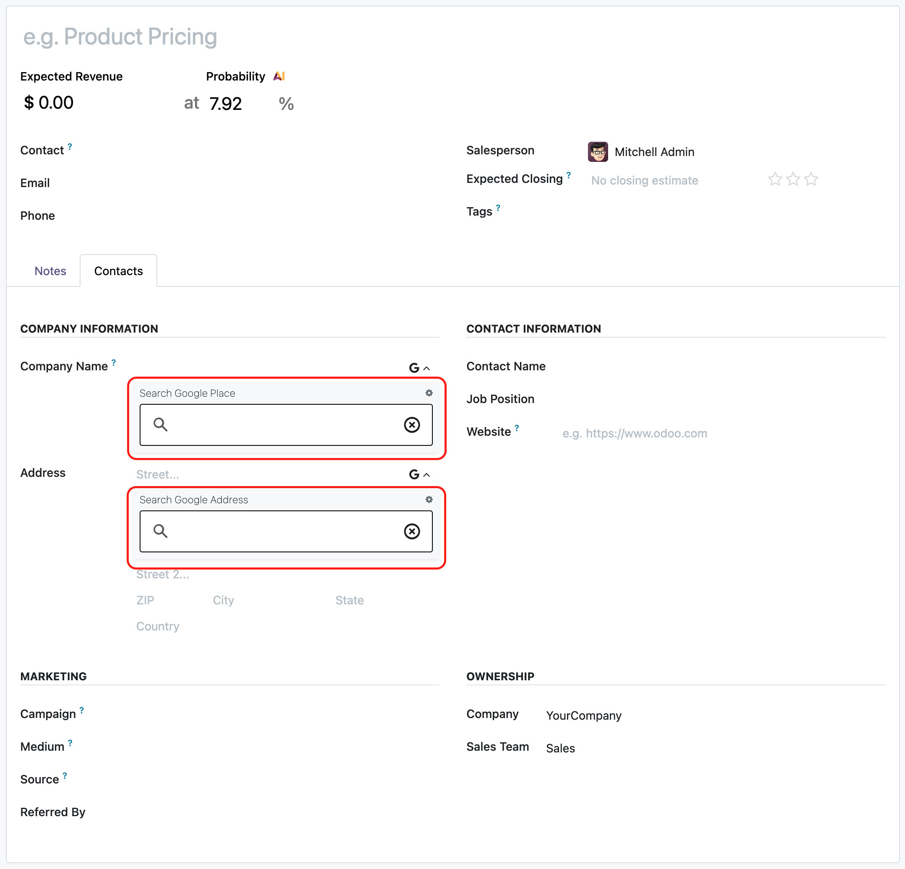

# CRM Google Places Autocomplete

## Overview

The `crm_google_autocomplete` module adds [Google Places Autocomplete Element](https://developers.google.com/maps/documentation/javascript/place-autocomplete-new) functionality to the Lead/Opportunity form. It enhances the company name and street fields with Google Places autocomplete, making it faster to fill in lead and opportunity information with accurate address data.

## Features
- Autocomplete for Lead/Opportunity company name and street fields using Google Places API
- Automatic population of address fields (street, city, state, zip, country) based on selected place
- Configurable field mappings between Google Places data and Odoo Lead/Opportunity fields

  

## Installation & Configuration

1. Configure your Google Maps API key in `Settings > General Settings > Google Maps`
2. The module automatically configures Google Place mapping for CRM during installation
3. Open a Lead/Opportunity form and start typing in the company name or street field to see autocomplete suggestions
4. Places API (New) must be enabled in your Google Cloud Console.

### Notes
This module replaces the following modules from previous versions:
- crm_gautocomplete_address_form
- crm_gautocomplete_address_form_extended
- crm_gautocomplete_places
- crm_gautocomplete_places_extended

## Authors
- [Yopi Angi](https://www.github.com/gityopie)
