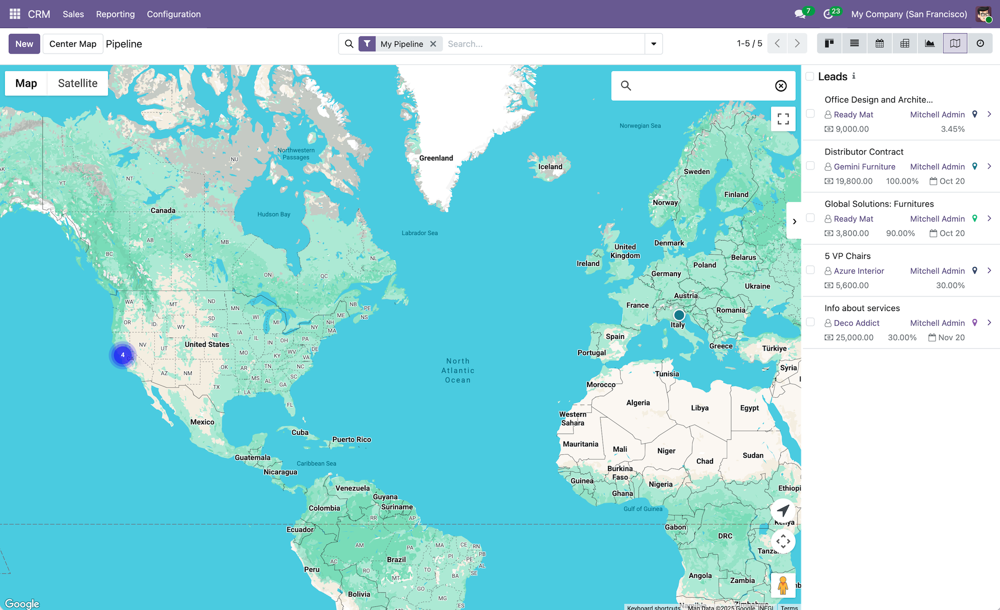

# CRM Google Maps

The `crm_google_map` module adds Google Maps view to the CRM application for leads and opportunities. It allows you to visualize your leads and opportunities on an interactive Google Map, helping sales teams identify geographical clusters and plan territory coverage.

  

## Features
- Interactive Google Map view for CRM leads and opportunities with clustering and sidebar
- Quick actions from the map sidebar to open lead/opportunity records
- View leads/opportunities plotted on the map based on their addresses
- Shift + drag to select multiple leads/opportunities directly from the map

## Installation & Configuration

1. Configure your Google Maps API key in `Settings > General Settings > Google Maps`
2. Navigate to `CRM > Leads` or `CRM > Opportunities` and switch to the Google Map view
3. View your leads/opportunities plotted on the map based on their addresses
4. Maps JavaScript API must be enabled in your Google Cloud Console.

## Authors
- [Yopi Angi](https://www.github.com/gityopie)
