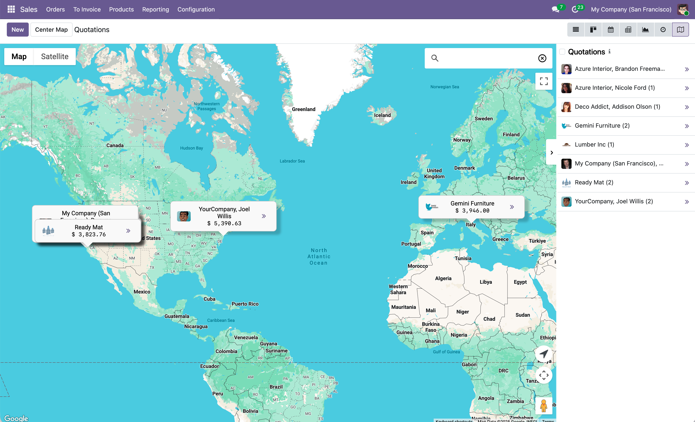

# Sales Google Maps

## Overview

`sale_google_map` adds an interactive Google Maps view to the Sales application. Sales orders and quotations are grouped by customer on the map, giving sales teams a clear geographical picture of where their business is concentrated.

  

## What It Does

Adds a "Map" view button to the Quotations and Orders list. Each customer with geolocated records appears as a single marker on the map. Clicking the marker or the sidebar entry lets you open the related orders or find other nearby customers.

## Key Features

- **Customer-Grouped Markers**: One marker per customer — shows their name, total order value, and avatar
- **"Open" Action**: Click the arrow button on a marker or sidebar entry to open all orders for that customer
- **"Find Nearby" Action**: Click the location-arrow button on a marker or sidebar to search for nearby customers
- **Sidebar with Totals**: Left-hand panel lists all customers with their avatar and aggregated order total
- **Automatic Group Loading**: Groups are expanded automatically when the map loads so all markers appear without manual interaction
- **Marker Hover Animation**: Markers lift and glow on hover for quick visual identification
- **Overlap Indicator**: When two customers share the same address, shifted markers show a visual indicator pointing to the original location
- **Grouped-Only Enforcement**: The view requires records to be grouped; a notification guides the user if grouping is missing

## Dependencies

- `sale_management`
- `web_view_google_map`

## Installation

1. Install the module through Odoo Apps
2. Configure your Google API Key and Map ID in `Settings > General Settings > Google Maps`

## Basic Usage

1. Go to `Sales > Quotations` or `Sales > Orders`
2. Click the **Map** view icon in the top-right
3. Your customers appear as markers based on their address
4. Click any marker or sidebar entry to open the related sales orders

## Related Modules

- `base_google_map`: Core Google Maps API key configuration
- `web_view_google_map`: Base map view framework used by this module

## Authors

- [Yopi Angi](https://www.github.com/gityopie)
