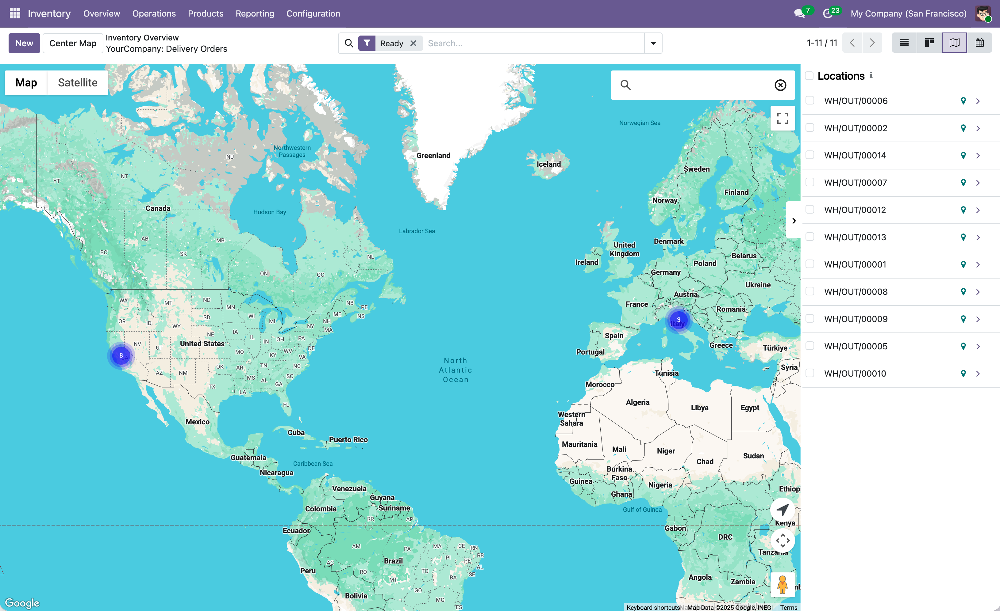

# Delivery Google Maps

The `stock_google_map` module adds Google Maps view to the Inventory/Delivery application. It allows you to visualize delivery orders and stock pickings on an interactive Google Map, helping logistics teams optimize delivery routes and plan warehouse operations.

  

## Features
- Interactive Google Map view for Delivery Orders with clustering and sidebar
- Quick actions from the map sidebar to open delivery order records
- View deliveries plotted on the map based on delivery addresses
- Shift + drag to select multiple deliveries directly from the map

## Installation & Configuration
1. Configure your Google Maps API key in `Settings > General Settings > Google Maps`
2. Navigate to `Inventory > Delivery Orders` and switch to the Google Maps view
3. View your deliveries plotted on the map based on delivery addresses
4. Maps JavaScript API must be enabled in your Google Cloud Console.

## Authors
- [Yopi Angi](https://www.github.com/gityopie)
