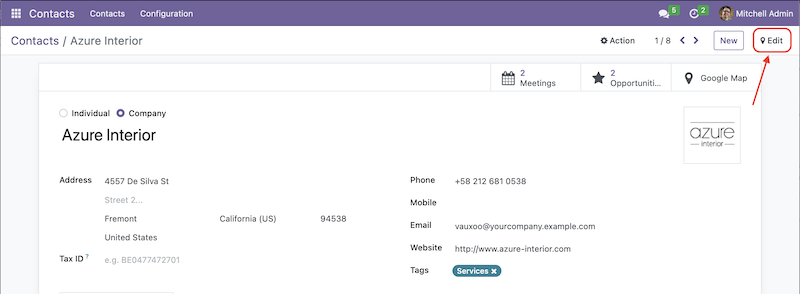

# Change Log

## 16.0.3.2.2
### Added
## "Edit Geolocation" on form view    
    
New subview of form view `"google_map_form"`. This subview is designed specifically to edit geolocation fields (latitude and longitude).    
To activate the button, there are four new attributes:    
  1. `"edit_lat_lng"`    
     An attribute to show the button
  2. `"google_map_form_view_ref"` (optional)    
     An attribute to tell Odoo which view to render. If you have multiple views for `"google_map_form"` (should be a rare case), this attribute would be very helpful.
  3. `"lat"`    
     An attribute to let the view know the latitude field
  4. `"lng"`    
     An attribute to let the view know the longitude field

  Example:    
  ```xml
    <!-- google_map form view -->
    <record id="view_my_google_map_form" model="ir.ui.view">
        <field name="name">view.my.google.map.form</field>
        <field name="model">res.partner</field>
        <field name="arch" type="xml">
            <form js_class="google_map_form" string="Contact" lat="partner_latitude" lng="partner_longitude">
                <field name="partner_latitude"/>
                <field name="partner_longitude"/>
            </form>
        </field>
    </record>

    <!-- the form view -->
    <recod id="view_my_form" model="ir.ui.view">
        <field name="name">view.my.form</field>
        <field name="model">res.partner</field>
        <field name="arch" type="xml">
            <form string="My Form" edit_lat_lng="1" google_map_form_view_ref="my_module.view_my_google_map_form">
                ...
            </form>
        </field>
    </record>
  ```
  Note: cannot re-use or share the existing form view for the google_map form or create only one form view for both.

### Changed
### Fixed


## [16.0.2.2.2] -- 22/08/2023
### Added
- FontAwesome icon as marker    
Check this url https://fontawesome.com/v6/search?o=r&m=free&s=solid for available icon that can be used.
- Two new optional attributes `"marker_icon"` and `"icon_scale"`    
  - `marker_icon`    
  An attribute to assign FontAwesome icon to marker(s) rendered on the `google_map` view. Default icon is `"location-dot"` https://fontawesome.com/icons/location-dot?f=classic&s=solid    
  Use the FontAwesome icon name without prefix `"fa"` for example, icon `"fa-flag"` (https://fontawesome.com/icons/flag?f=classic&s=solid) then in the `"marker_icon"` attribute just use `"flag"`.    
    Example:    
    ```xml
    <google_map marker_icon="flag">
      ...
    </google_map>
    ```
  - `icon_scale`    
  An attribute to set the scale of the FontAwesome icon. Default value is `1`.    
    Example:    
    ```xml
    <google_map icon_scale="0.8">
      ...
    </google_map>
    ```
### Changed
### Fixed

## [16.0.1.2.2] -- 19/07/2023
### Added

### Changed

### Fixed
 - The Google search input placed inside the map becomes transparent.

## [16.0.1.2.1] -- 12/05/2023
### Added
### Changed
### Fixed
* Bug fixes and improvement
  - Add loading window
  - Improved reactivity of the view `"google_map"` and it's sub-view

## [16.0.1.1.1] -- 12/04/2023
### Added

### Changed
- Clicked the button "Open" on the marker info window will open form view in a dialog, before it's switched to form view page.

### Fixed
- Google maps and the markers are not processed until the Google loader is fully loaded
- Unfold/fold sidebar no longer reset the center of the map
- Fixed reactivity issue of component `GoogleMapSidebar`
- Remove unused props