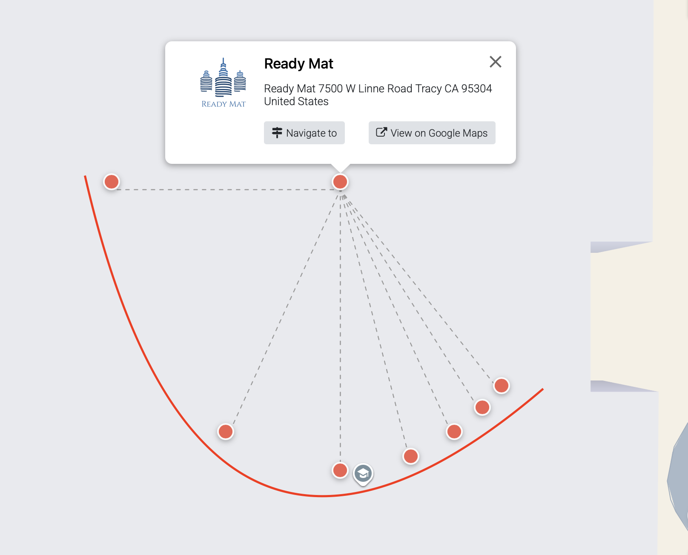
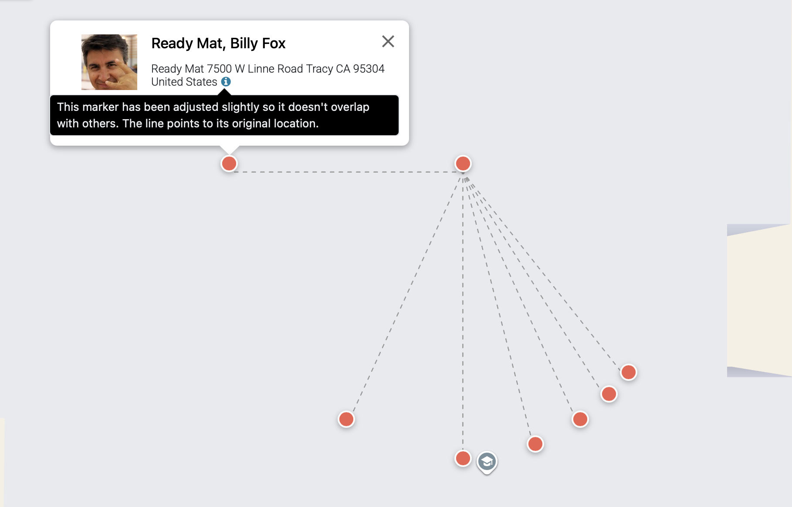

# Web View — Google Maps

Turn any Odoo model with latitude/longitude fields into an interactive Google Maps. This view type adds a powerful map visualization with clustering, grouping, a searchable sidebar, and quick actions.

Requirements
- Module dependency: `base_google_map` (provides API key setup and loader)
- A valid Google Maps API key configured in Settings > General Settings > Google Maps
- Maps JavaScript API enabled in your Google Cloud Console
- Map ID

Quick start
```xml
<!-- View -->
<record id="view_res_partner_google_map" model="ir.ui.view">
    <field name="name">view.res.partner.google_map</field>
    <field name="model">res.partner</field>
    <field name="arch" type="xml">
        <google_map string="Contacts" lat="partner_latitude" lng="partner_longitude" sidebar_title="display_name" sidebar_subtitle="contact_address" color="marker_color">
            <field name="partner_latitude"/>
            <field name="partner_longitude"/>
            <field name="display_name"/>
            <field name="contact_address"/>
            <field name="marker_color"/>
        </google_map>
    </field>
</record>

<!-- Action -->
<record id="action_partner_map" model="ir.actions.act_window">
    <field name="name">Contacts (Map)</field>
    <field name="res_model">res.partner</field>
    <field name="view_mode">kanban,tree,form,google_map</field>
</record>
```

### Attributes reference
- Required
    - `lat`: name of the latitude field
    - `lng`: name of the longitude field
    - `sidebar_title`: field to use as the record title in the sidebar (Char or Many2one)
- Recommended
    - `string`: header title shown at the top of the sidebar
    - `sidebar_subtitle`: secondary text under the title (Char or Many2one)
- Visuals
    - `color`: marker color. Accepts a hex (e.g., #FF0000), a CSS color name (e.g., red), or a field name (Integer) paired with widget="color_picker" in a form view.
        Examples:
        1) Fixed hex color or color name
        ```xml
        <google_map color="#FF0000">...</google_map>
        ```
        2) Color from a field
        ```xml
        <google_map color="marker_color">...</google_map>
        <!-- Make sure the field is paired with widget "color_picker" in form view -->
        <field name="marker_color" widget="color_picker"/>
        ```
- Map behavior
    - `map_type`: roadmap | satellite | hybrid | terrain (default: roadmap)
    - `gesture_handling`: auto | cooperative | greedy | none (default: auto)
    - `disable_cluster_marker`: set to 1 to disable marker clustering (enabled by default)
        ```xml
        <google_map disable_cluster_marker="1">...</google_map>
        ```
    - `map_id`: Map ID to use a specific styled map than the one configured in settings. Setting this attribute overrides the Map Id configured in settings.
- Data and limits
    - `limit`: max records to load (default: 100)
    - `count_limit`: show an approximate total above this count
    - `default_order`: default ordering, e.g., "name desc"
    - `default_group_by`: group records from a many2one field (enables grouped sidebar)


Using the map inside a form
You can also embed a map in a form view (commonly used with drawing or shapes modules):
```xml
<field name="shape_line_ids" widget="google_map_drawing_one2many" mode="google_map">
    <google_map js_class="google_map_drawing" sidebar_title="gshape_name" sidebar_subtitle="gshape_description" geojson="gshape_geojson" color="gshape_color" map_type="hybrid" gesture_handling="cooperative">
        <field name="partner_id"/>
        <field name="gshape_name"/>
        <field name="gshape_area"/>
        <field name="gshape_description"/>
        <field name="gshape_geojson"/>
        <field name="gshape_color"/>
    </google_map>
</field>
```

## Features
- Marker clustering and auto-fit to bounds (with a sensible max auto-zoom)
- Sidebar listing with selection, grouping support, and quick actions
- Click-to-open record in dialog or form view; optional custom action routing
- Built-in geolocate button and in-map place search (configurable via settings)
- Export support via the standard action menu (when allowed)
- Press Command or Alt + drag to select multiple records directly from the map
- Customizable marker colors via color picker fields or fixed colors


## Handling multiple markers at the same location
When multiple records share the exact same latitude and longitude, markers are slightly shifted apart to ensure visibility and interactivity. Clicking on a shifted marker will zoom in further to help users see the connection line to the actual location.
<div style="display: flex; gap: 4px; justify-content: center;">
  
  
</div>


## Setup and configuration
1) Google Maps API Key. Visit https://developers.google.com/maps/documentation/javascript/get-api-key to get an API key
2) Enable the following APIs in your Google Cloud Console:
   - Maps JavaScript API
   - Geocoding API
   - Places API (NEW) -> optional but required for in-map place search and (later) if Google Places Autocomplete module is installed.

## Authors
- [Yopi Angi](https://www.github.com/gityopie)
