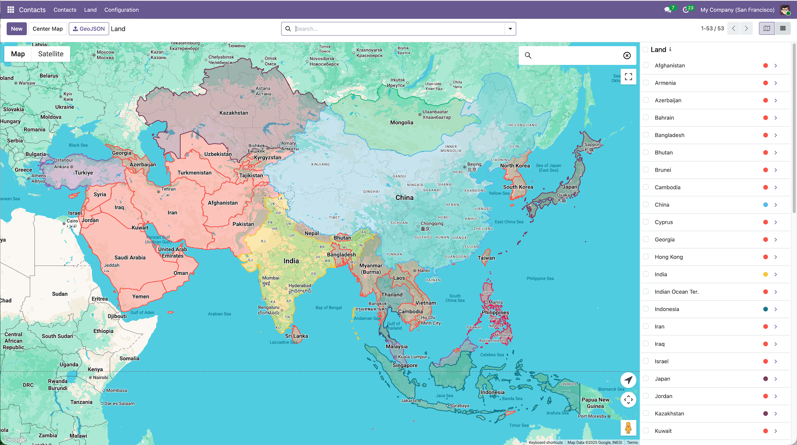
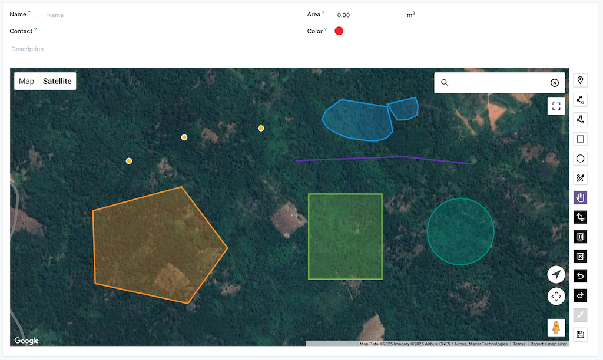

# Web View Google Maps Drawing

This module allows you to manage GeoJSON data using Google Maps integrated with [Terra Draw library](https://terradraw.io/), [Deck.gl](https://deck.gl/), and [Turf.js](https://turfjs.org/).
The Google Maps Drawing has been deprecated ([source](https://developers.google.com/maps/deprecations#drawing_library_deprecated_as_of_aug_8_2025)). As an alternative (suggested by Google) this module uses Terra Draw to provide drawing capabilities on Google Maps.

<div style="display: flex; gap: 4px; justify-content: center;">
  
</div>

## Features

- **Drawing Tools**: Point, LineString, Polygon, Rectangle, Circle, and Freehand drawing modes
- **GPU-Accelerated Rendering**: Deck.gl provides smooth 60fps rendering for 10k+ features
- **Real-time Measurements**: Area, perimeter, length calculations using Turf.js
- **GeoJSON Import**: Upload GeoJSON files directly into the drawing canvas
- **Undo/Redo**: Full history management for drawing operations
- **Feature Simplification**: Reduce complex geometry for better editing performance
- **Keyboard Shortcuts**: Efficient operation with keyboard controls

## Keyboard Shortcuts

| Shortcut | Action |
|----------|--------|
| `1` - `7` | Switch drawing modes (Select, Point, Line, Polygon, Rectangle, Circle, Freehand) |
| `Delete` / `Backspace` | Delete selected feature |
| `Escape` | Switch to select mode |
| `Ctrl+Z` / `Cmd+Z` | Undo |
| `Ctrl+Shift+Z` / `Ctrl+Y` | Redo |
| `Ctrl+S` / `Cmd+S` | Save changes |
| `Ctrl+E` / `Cmd+E` | Simplify selected feature |
| `C` | Clear all features |

## Usage

### 1. `google_map_drawing` a sub-view of `google_map` view
A new view to display geolocation data using Google Maps with drawing capabilities.

How to create the view?

```xml
<!-- View -->
<record id="view_res_partner_area_map" model="ir.ui.view">
    <field name="name">view.res.partner.area.map</field>
    <field name="model">res.partner.area</field>
    <field name="arch" type="xml">
        <google_map js_class="google_map_drawing" geojson="gshape_geojson" string="Land" color="gshape_color" sidebar_title="gshape_name" sidebar_subtitle="partner_id">
            <field name="partner_id"/>
            <field name="gshape_name"/>
            <field name="gshape_area"/>
            <field name="gshape_description"/>
            <field name="gshape_geojson"/>
            <field name="gshape_color"/>
        </google_map>
    </field>
</record>


<!-- Action -->
<record id="action_partner_area_map" model="ir.actions.act_window">
    ...
    <field name="view_mode">kanban,list,form,google_map</field>
    ...
</record>
```

Mandatory attributes:
- `js_class`: attribute to load Google Maps Drawing, must be set with `google_map_drawing`
- `sidebar_title`: attribute to be used on a sidebar of map, to display name of record (only support field `Char` and field `Many2one` )
- `geojson`: attribute to be used to load geojson data from field

Optional attributes:
- `sidebar_subtitle`: attribute to be used on a sidebar of map, to display secondary info that you would like to display (only support field `Char` and field `Many2one`)
- `color`: attribute to be used to set color of shape, can use hex color (e.g., #FF0000), CSS color name (e.g., red), or field name (Integer) paired with widget="color_picker" in form view.
- `map_type`: roadmap | satellite | hybrid | terrain (default: roadmap)
- `gesture_handling`: auto | cooperative | greedy | none (default: auto)
- `map_id`: to set specific Map ID configured in Google Cloud Console, configured this attribute overrides the Map ID configured in Settings > General Settings > Google Maps


### Use `google_map` view inside `form` view

For field `One2many` it is a must to use widget `google_map_drawing_one2many`
and for field `Many2many` uses widget `google_map_drawing_many2many`

Example:
```xml
<field name="shape_line_ids" widget="google_map_drawing_one2many" mode="google_map">
    <google_map js_class="google_map_drawing" string="Land" sidebar_title="gshape_name" sidebar_subtitle="partner_id" color="gshape_color" geojson="gshape_geojson" map_type="hybrid" gesture_handling="cooperative">
        <field name="partner_id" invisible="1"/>
        <field name="gshape_name"/>
        <field name="gshape_area"/>
        <field name="gshape_description"/>
        <field name="gshape_geojson"/>
        <field name="gshape_color"/>
    </google_map>
</field>
```

### 2. New widget `google_map_terra_draw`
In order to activate the drawing mode, it's a must to apply widget `google_map_terra_draw` to field `gshape_geojson` (or any fields on your own) in view `form`

<div style="display: flex; gap: 4px; justify-content: center;">
  
</div>

Example:
```xml
<record id="view_res_partner_area_form" model="ir.ui.view">
    <field name="name">view.res.partner.area.form</field>
    <field name="model">res.partner.area</field>
    <field name="arch" type="xml">
        <form string="Area">
            <sheet>
                ...
                <field name="gshape_geojson" widget="google_map_terra_draw" options="{'map_type_id': 'hybrid', 'default_zoom': 14, 'default_center': [-6.175664127601439, 106.82703162885998], 'field_area': 'gshape_area'}"/>
            </sheet>
        </form>
    </field>
</record>
```

Widget options:
- `map_type_id`: roadmap | satellite | hybrid | terrain (default: roadmap)
- `default_zoom`: default zoom level when loading the map (default: 12)
- `default_center`: default center of the map when loading, format: [lat, lng] (default: [0, 0])
- `field_area`: field name to store area value (in square meters) calculated from the drawn shape. This field should be of type Float.

This module contains a demo module `contacts_area` that you can find in folder example, a module to demonstrate how to use the view and the widget.


If you have difficulties implement or use the view and the widget on your custom module, please do not hesitate to open an issue.

## External Libraries

All libraries are bundled locally for reliability and offline capability:

| Library | Purpose |
|---------|---------|
| [Terra Draw](https://terradraw.io/) | Drawing tools and feature editing |
| [Terra Draw Google Maps Adapter](https://github.com/JamesLMilner/terra-draw) | Google Maps integration for Terra Draw |
| [Deck.gl](https://deck.gl/) | GPU-accelerated rendering for large datasets |
| [Turf.js](https://turfjs.org/) | Geospatial measurements and calculations |

## Known issues and limitations
- Terra Draw doesn't support GeoJSON with holes or interior rings. Such GeoJSON will be rendered in read-only mode using Deck.gl.
- Editing very large GeoJSON data may lead to performance issues. Use the "Simplify Selected Feature" button in the drawing toolbar to reduce complexity, but be aware that this may result in a loss of detail.
- Resize the browser window may cause the map to not render properly. To fix this issue, you can refresh the browser page.
- GeoJSON file import is limited to 5MB file size.

## Authors
- [Yopi Angi](https://www.github.com/gityopie)
