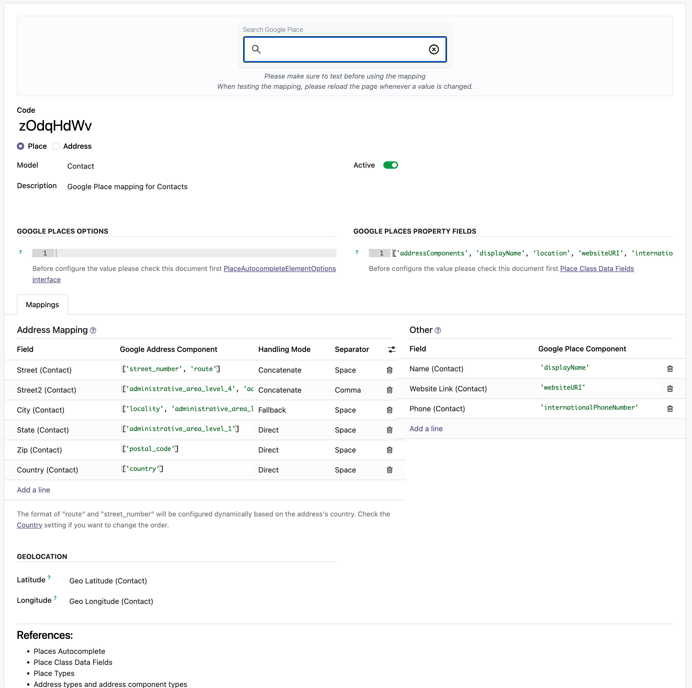
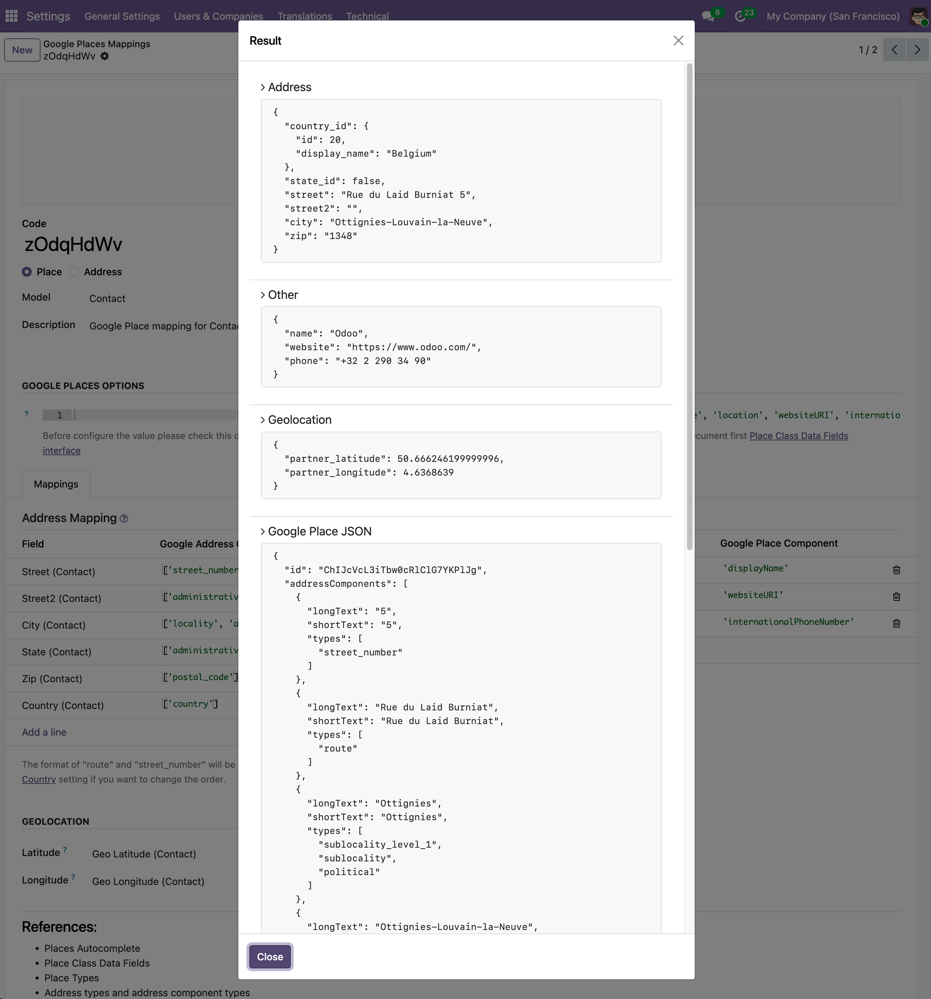
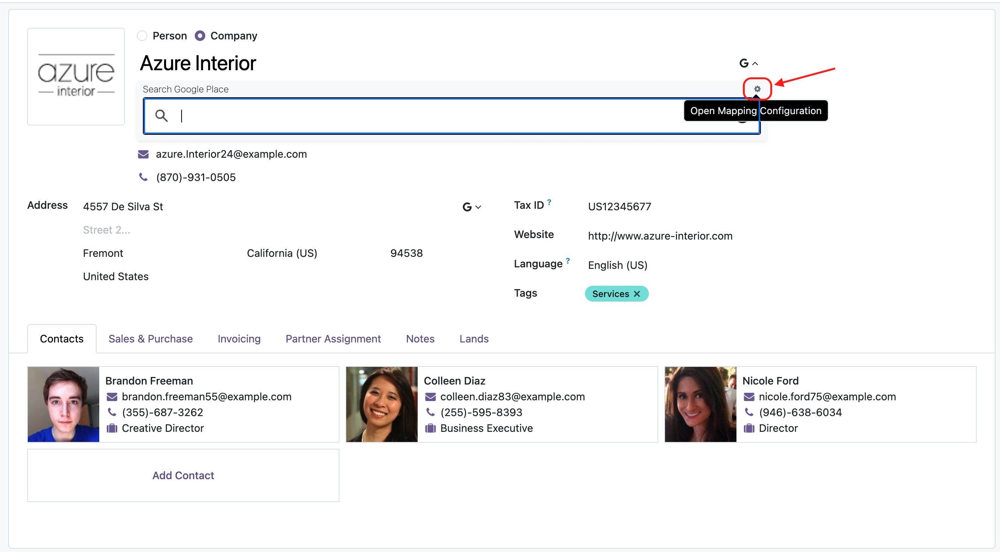

# Web Widget Google Place Autocomplete

The `web_widget_google_place_autocomplete` module provides a new widget implementation using Google's Places API(New) [https://developers.google.com/maps/documentation/javascript/place-autocomplete-new](https://developers.google.com/maps/documentation/javascript/place-autocomplete-new).    
It offers enhanced autocomplete functionality with improved address mapping capabilities and configurable field mappings per country through a dedicated configuration interface.

This widget gives you full control over how Google Places data is mapped to your Odoo model fields, allowing for a more tailored and accurate data entry experience.

## Table of Contents

- [Features](#features)
- [Screenshots](#screenshots)
- [Widget: gplace_autocomplete_el](#widget-gplace_autocomplete_el)
  - [Usage](#usage)
  - [Configuration Options](#configuration-options)
  - [Street Formatting](#street-formatting)
- [Installation & Configuration](#installation--configuration)
- [Examples](#examples)
- [Troubleshooting](#troubleshooting)
- [Authors](#authors)

## Features

- **Google Places API (New)**: Leverages the latest Google Places API for improved accuracy and performance
- **Flexible Field Mapping**: Configure custom mappings between Google Places data and Odoo fields
- **Multiple Mapping Modes**: Support for both "places" and "address" autocomplete modes
- **Interactive Mapping Test**: Built-in testing tool to verify your field mappings
- **Quick Access**: Shortcut button in form views to access mapping configuration
- **Street Format Control**: Configure street formatting per country (route + number or number + route)

## Screenshots

<div style="display: flex; gap: 4px; justify-content: center; margin-bottom: 50px;">
  
  
</div>

You can also access the mapping configuration quickly via the shortcut button next to the autocomplete input field in the form view.

<div style="display: flex; gap: 4px; justify-content: center;">
  
</div>

## Widget: gplace_autocomplete_el

This module introduces a new widget named `gplace_autocomplete_el` that leverages the latest Google Places API for enhanced autocomplete functionality.

### Prerequisites

Before using the widget, ensure you have:

1. Google Maps API key with Places API (New) enabled
2. At least one mapping configuration created in `Settings > Technical > Google Places Mapping`

**Reference Examples**: Check the `contacts_google_autocomplete` or `crm_google_autocomplete` modules for pre-configured mapping examples.

### Usage

To use the widget in your form views, you can configure it in two ways:

#### Option 1: Using Mapping Code (Recommended)

The `mapping_code` is the unique identifier of your mapping configuration. This option takes priority over `mapping_mode`.

```xml
<record id="view_form_your_model" model="ir.ui.view">
  <field name="name">your.model.form</field>
  <field name="model">your.model</field>
  <field name="arch" type="xml">
    <form>
      ...
      <field name="your_field_name" widget="gplace_autocomplete_el"
             options="{'mapping_code': 'your_mapping_code'}"/>
      ...
    </form>
    </field>
</record>
```

#### Option 2: Using Mapping Mode

There are two available mapping modes:

- **`places`**: General places autocomplete (businesses, landmarks, addresses)
- **`address`**: Restricted to street addresses only

```xml
<record id="view_form_your_model" model="ir.ui.view">
  <field name="name">your.model.form</field>
  <field name="model">your.model</field>
  <field name="arch" type="xml">
    <form>
      ...
      <field name="your_field_name" widget="gplace_autocomplete_el"
             options="{'mapping_mode': 'address'}"/>
      ...
    </form>
    </field>
</record>
```

### Configuration Options

1. Autocomplete Options (optional)   
The widget behavior can be customized using Google Places Autocomplete options. These options are configured in the mapping configuration and control the autocomplete element initialization.    
Please check this document [Google Places Autocomplete documentation](https://developers.google.com/maps/documentation/places/web-service/place-autocomplete#supported-parameters) for more details.

**Example**: For address-only results, configure your mapping with:
```python
{'includedPrimaryTypes': ['route', 'street_address']}
```

2. Fields Property (mandatory)   
It's recommended to define the `fields` property in your mapping configuration to specify which Google Places fields to retrieve. This optimizes performance by limiting data retrieval to only necessary fields.     
Use the fields property wisely as it affects the cost of API usage.    
Please check this document [Place Fields documentation](https://developers.google.com/maps/documentation/javascript/place-class-data-fields) for more details.    


**Example**: To retrieve only location(geolocation) and address, configure your mapping with:
```python
['location', 'addressComponents']
```
### Street Formatting

Countries now include a "Street Format" field (`street_format`) to control how street addresses are formatted:

- **`route_street_number`** (default): Route name followed by street number (e.g., "Main Street 123")
- **`street_number_route`**: Street number followed by route name (e.g., "123 Main Street")

Configure this in `Contacts > Configuration > Countries` for each country.


## Installation & Configuration

### Step 1: Google Cloud Platform Setup

1. Go to the [Google Cloud Console](https://console.cloud.google.com/)
2. Enable the following APIs:
   - **Places API (New)** - Required for the new widget
   - **Maps JavaScript API** - Required for map display
   - **Geocoding API** - Optional, for additional geocoding features
3. Create or use an existing API key with the above APIs enabled

### Step 2: Odoo Configuration

1. Install the `web_widget_google_place_autocomplete` module
2. Go to `Settings > General Settings > Google Maps`
3. Configure your Google Maps API key
4. Save the configuration

### Step 3: Create Mapping Configuration

1. Go to `Settings > Technical > Google Places Mapping`
2. Create a new mapping configuration:
   - **Name**: Descriptive name for your mapping
   - **Model**: Target Odoo model (e.g., `res.partner`, `crm.lead`)
   - **Mapping Mode**: Choose `address` or `places`
   - **Field Mappings**: Map Google Places fields to Odoo model fields.    
      There are two sections: 
      - **Address Mapping**: For general address fields
      - **Other**: For any fields outside of the address scope
3. Use the Section test to test your mapping configuration

### Step 4: Apply Widget to Forms

Add the widget to your form views using one of the methods described in the [Usage](#usage) section.

## Examples

### Example 1: Using Mapping Code on inherited form view

```xml
<record id="view_partner_form_custom" model="ir.ui.view">
  <field name="name">res.partner.form.custom</field>
  <field name="model">res.partner</field>
  <field name="inherit_id" ref="base.view_partner_form"/>
  <field name="arch" type="xml">
    <field name="street" position="attributes">
      <attribute name="widget">gplace_autocomplete_el</attribute>
      <attribute name="options">{'mapping_code': 'ibSbbpMF'}</attribute>
    </field>
  </field>
</record>
```

### Example 2: Using Mapping Mode on inherited form view

```xml
<record id="view_crm_lead_form_custom" model="ir.ui.view">
  <field name="name">crm.lead.form.custom</field>
  <field name="model">crm.lead</field>
  <field name="inherit_id" ref="crm.crm_lead_view_form"/>
  <field name="arch" type="xml">
    <field name="street" position="attributes">
      <attribute name="widget">gplace_autocomplete_el</attribute>
      <attribute name="options">{'mapping_mode': 'address'}</attribute>
    </field>
  </field>
</record>
```

## Troubleshooting

### Widget Not Showing Autocomplete Suggestions

**Possible causes:**
- Google API key not configured or invalid
- Places API (New) not enabled in Google Cloud Console
- API key restrictions blocking requests
- Network/firewall blocking Google APIs

**Solution:**
1. Check API key configuration in `Settings > General Settings`
2. Verify Places API (New) is enabled in Google Cloud Console
3. Check browser console for API errors
4. Verify API key has no IP/domain restrictions preventing access

### Fields Not Populating After Selection

**Possible causes:**
- Mapping configuration not properly set up
- Field names in mapping don't match model fields
- Country-specific mapping missing

**Solution:**
1. Go to `Settings > Technical > Google Places Mapping`
2. Verify your mapping configuration exists and is active
3. Use the "Test Mapping" feature to verify field mappings
4. Check that mapped field names exactly match your model's field names
5. Ensure country-specific mappings are configured for target countries

### Incorrect Street Formatting

**Possible causes:**
- Country street format not configured
- Using default formatting when country-specific format is needed

**Solution:**
1. Go to `Contacts > Configuration > Countries`
2. Find the target country
3. Set the "Street Format" field to the appropriate value:
   - `route_street_number` for "Street Name Number"
   - `street_number_route` for "Number Street Name"

### Quick Access Button Not Visible

**Possible causes:**
- User doesn't have technical features enabled
- Widget options not properly configured

**Solution:**
1. Enable "Technical Features" for your user in `Settings > Users & Companies > Users`
2. Verify the widget is properly configured with a valid `mapping_code` or `mapping_mode`

## Authors

- [Yopi Angi](https://www.github.com/gityopie)
